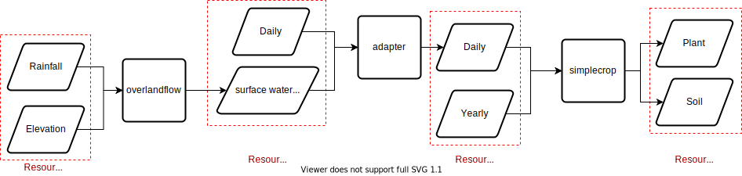

---
jupytext:
  text_representation:
    extension: .md
    format_name: myst
    format_version: 0.13
    jupytext_version: 1.10.3
kernelspec:
  display_name: Python 3 (ipykernel)
  language: python
  name: python3
---

# Combining Overland Flow and Simple Crop

## Running Overland Flow on its Own

The overland flow model routes water over a landscape and determines how much water infiltrates particular cells in response to rain events and elevation data. Rainfall in this model is assumed to occur instantaneously and rainfall events are assumed to be independent (so a large rainfall event on a previous day has no bearing on the present day).

In order to run the model we first need to import some source and sink types as well as classes for calling off to CLI models and building requests.

```{code-cell} ipython3
import itertools
import os.path
import netCDF4
from meillionen.client import ClientFunctionModel

from meillionen.interface.resource import Feather, NetCDF, OtherFile, Parquet
from meillionen.interface.schema import PandasHandler, NetCDFHandler
from meillionen.settings import Settings, Partitioning
from meillionen.clienti import Client, CLIRef
from prefect import task, Flow

BASE_DIR = '../../examples/crop-pipeline'
INPUT_DIR = os.path.join(BASE_DIR, 'workflows/inputs')
OUTPUT_DIR = os.path.join(BASE_DIR, 'workflows/outputs')

settings = Settings(
    base_path=OUTPUT_DIR
)
```

and build a request to call our model with.

```{code-cell} ipython3
overlandflow = Client(CLIRef('overlandflow'), settings=settings)
```

 We also need to create sources and sinks to describe our data

```{code-cell} ipython3
elevation = FileResource(".asc")

weather = FeatherResource()

sources = {
    'elevation': elevation,
    'weather': weather
}
```

Then call the overland flow model with our request (which will create files on the file system)

```{code-cell} ipython3
overland_payloads = overlandflow.run(
    class_name='overlandflow',
    method_name='run',
    resource_payloads={
        'elevation': OtherFile(os.path.join(INPUT_DIR, 'elevation.asc')),
        'weather': Feather(os.path.join(INPUT_DIR, 'weather.feather')),
        'soil_water_infiltration__depth': NetCDF.partial('swid')
    }
)
```

## Running Simple Crop on its Own

`simplecrop`  is a model of yearly crop growth that operates on the command line. When called in the current directory with no arguments it expects that there is a data folder. It expects that the data folder contains five files

- `irrig.inp` - daily irrigation
- `plant.inp` - plant growth parameters for the simulation
- `simctrl.inp` - simulation reporting parameters
- `soil.inp` - soil characteristic parameters for the simulation
- `weather.inp` - daily weather data (with variables like maximum temperature, solar energy flux)

`simplecrop` also expects there to be an output folder. After the model has run it will populate the output folder with three files

- `plant.out`- daily plant characteristics
- `soil.out` - daily soil characteristics
- `wbal.out` - summary soil and plant statistics about simulation

In order to wrap this model in an interface that allows you to run the model without manually building those input files and manually converting the output files into a format conducive to analysis we need to have a construct the input files and parse the output files. Fortunately we have such a model wrapper already.

```{code-cell} ipython3
import pandas as pd

simple_crop = Client(CLIRef('simplecrop-omf'), settings=settings)
```

```{code-cell} ipython3
s = simple_crop.run(
    class_name='simplecrop',
    method_name='run',
    resource_payloads={
        'daily': Feather(),
        'yearly': Feather(),
        'plant': Feather.partial(),
        'soil': Feather.partial(),
        'tempdir': OtherFile.partial(ext='')
    })
```

```{code-cell} ipython3
soil_df = PandasHandler(s['soil']).load(s['soil'])
soil_df
```

## Using Prefect to Feed Overland Flow Results into Simple Crop

Now we'll combine overlandflow with simplecrop. This will require an adapter to augment the daily source data fed into simplecrop with the depth of water that has infiltrated that cell. The workflow is shown below  without the details of calling simplecrop for each x, y coordinate in the map.



```{code-cell} ipython3
from meillionen.client import ResourceBuilder
import pyarrow as pa
import pandas as pd
import pathlib

trial = settings.trial("simplecrop-parallelism")

overlandflow_payloads = {
  'elevation': OtherFile.partial(ext='.asc'),
  'weather': Feather()
}

overlandflow = Client(CLIRef('overlandflow'), settings=trial)

simplecrop_sinks = {
  'tempdir': FileResource(ext="", name="tmp")
}

simplecrop_partitioning = Partitioning(
    pa.schema([("x", pa.int32()), ("y", pa.int32())]))

simple_crop = Client(CLIRef('simplecrop-omf'), settings=trial)
```

```{code-cell} ipython3
class DailyRainfallCreator(ResourceBuilder):
    def __init__(self, settings, partitioning, validator):
        self.handler = PandasHandler(validator)
        super().__init__(name='daily', settings=settings, partitioning=partitioning)
        
    def save(self, daily_df, rainfall, partition):
        daily_df['rainfall'] = rainfall
        daily = self._complete(FeatherResource(), partition=partition)
        self.handler.save(daily, data=daily_df)
        return daily


daily_df = pd.read_feather(os.path.join(trial.sources.base_path, 'daily.feather'))
yearly = FeatherResource().build(settings=trial.sources, name='yearly')
        
daily_rainfall_creator = DailyRainfallCreator(
    settings=trial.sinks,
    partitioning=simplecrop_partitioning,
    validator=simplecrop.source('daily')
)

        
@task()
def run_overland_flow():
    sources = {
        'elevation': FileResource(ext=".asc"),
        'weather': FeatherResource()
    }

    sinks = overlandflow.run(sources=sources)

    return sinks['soil_water_infiltration__depth']


@task()
def chunkify_soil_water_infiltration_depth(swid):
    variable = NetCDFHandler(overlandflow.sink('soil_water_infiltration__depth')).load(swid)
    return [{'soil_water_infiltration__depth': variable[x, y, :], 'x': x, 'y': y}
            for (x,y) in itertools.product(range(10,13), range(21,24))]


@task()
def simplecrop_process_chunk(data):
    soil_water_infiltration__depth = data['soil_water_infiltration__depth']
    x, y = data['x'], data['y']
    daily = daily_rainfall_creator.save(
        daily_df,
        soil_water_infiltration__depth,
        partition=dict(x=x, y=y))
    
    sources = {
        'daily': daily,
        'yearly': yearly
    }

    sinks = simplecrop.run(sources=sources, partition=dict(x=x, y=y))

with Flow('crop_pipeline') as flow:
    overland_flow = run_overland_flow()
    surface_water_depth_chunks = chunkify_soil_water_infiltration_depth(overland_flow)
    yield_chunks = simplecrop_process_chunk.map(surface_water_depth_chunks)

flow.run()
```

```{code-cell} ipython3
from pyarrow.dataset import dataset

plant_df = dataset(
    os.path.join(OUTPUT_DIR, 'simplecrop-parallelism/plant'),
    partitioning=simplecrop_partitioning).to_table().to_pandas()
plant_df
```

## BMI Interface

Simple crop can also be used with an adapter to create a BMI Interface (with the additional `set_partition` method

```{code-cell} ipython3
from meillionen.pymt import PyMTFunctionModel

simplecrop_bmi = PyMTFunctionModel()
simplecrop_bmi.initialize(model=simplecrop)
```

```{code-cell} ipython3
simplecrop_bmi.get_input_var_names()
simplecrop_bmi.get_output_var_names()

simplecrop_bmi.set_value('daily', FeatherResource())
simplecrop_bmi.set_value('yearly', FeatherResource())
simplecrop_bmi.set_partition({'x': 30, 'y': 30})
simplecrop_bmi.update()
plant = simplecrop_bmi.get_value('plant')
soil = simplecrop_bmi.get_value('soil')
simplecrop_bmi.finalize()
```

```{code-cell} ipython3
plant.to_dict()
```

```{code-cell} ipython3
soil.to_dict()
```
